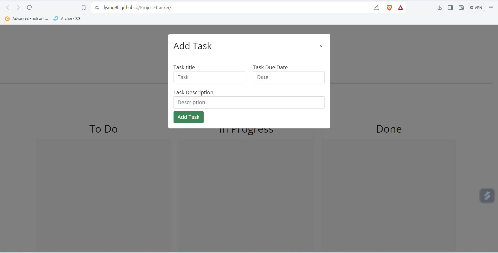
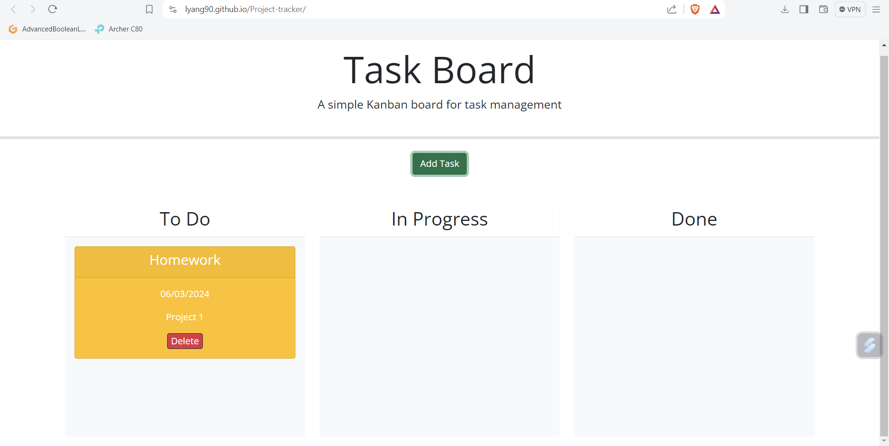

# Project-tracker

## Description
The idea behind this project is to track different kinds of projects and their due dates. This project was created to learn on how to use jQuery and bootstrap. The project helped with getting more familar with third party APIs. Throughout this project I was able to get a better understanding of how to utilize third party APIs. I learned how to use jQuery to select elements and create elements and what functions to use to edit the elements. While for bootstrap learning the different parameters need to be put into the HTML class to get a certain result.

## Installation
To run the webpage for the project tracker, the code can be downloaded and launched from the index.html. Or even simpler the link on the site can be clicked on the deployed site which can be used.

## Usage
TO use the site you can add various projects to the site and create a little note cards of each task and the progression of them each. Also, the note cards itself are draggable and can be put into any of the three progress columns and if the projects are wrong they can be removed with the delete button.

## Credits
Starter code was from Micheal McEwen: https://github.com/coding-boot-camp/musical-happiness
Documents used:
- Bootstrap: https://getbootstrap.com/docs/5.3/getting-started/introduction/
- DayPicker: https://bootstrap-datepicker.readthedocs.io/en/latest/
- Day.js API: https://day.js.org/docs/en/query/query
